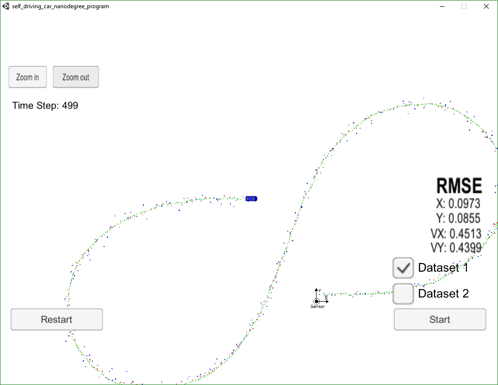
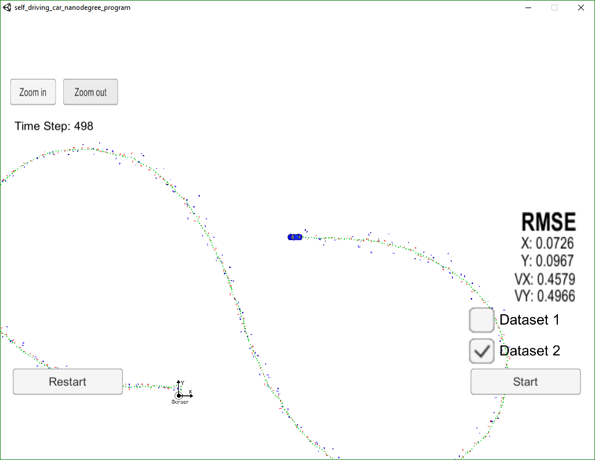
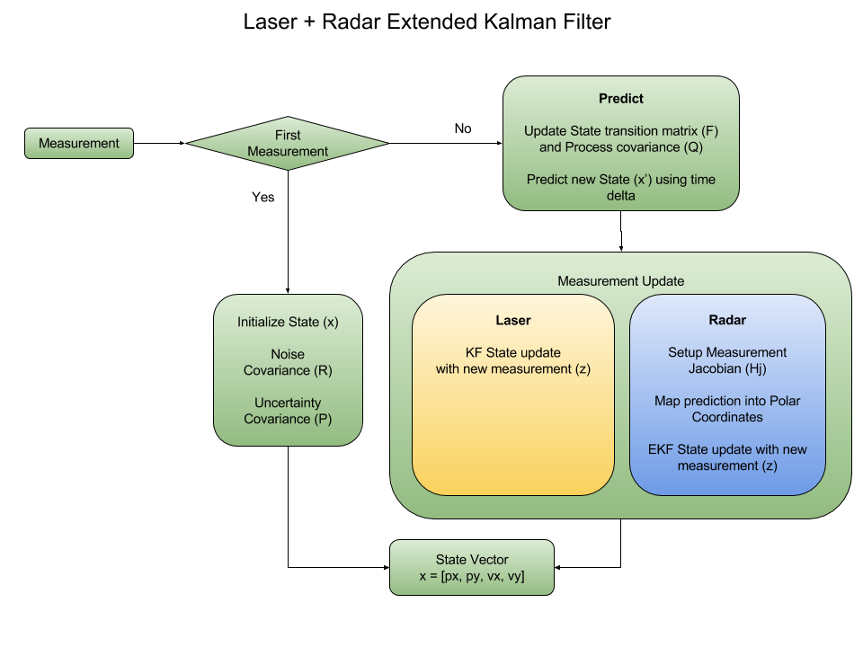

# Extended Kalman Filter Project
Self-Driving Car Engineer Nanodegree Program

## Introduction

This project utilizes a Kalman filter to estimate the state of a moving object of interest with noisy lidar and radar measurements.

## Code Should Compile

See Installation and Build instructions at the end of this writup.

## Accuracy

The algorithm was run against a simulator that included two datasets.  The first dataset was available for comparing the ground truth and the second dataset was hidden within the simulator itself. The accuracy of position and velocity of the target must be less than or equal to ```.11``` and ```.52``` repectively.

The final results of running the algorithm using both lidar and radar measurements against ```Dataset 1``` is shown below.



It can be seen that the RMSE met the criteria with px, py, vx, and vy of ```[.0973, 0.0855, 0.4513, 0.4399]```.

The sensor fusion of both lidar and radar actually creates a better estimate and achieved lower RMS error than if either was run independantly as shown in the following results performed on ```Dataset 1```.

Lidar only: px, py, vx, and vy of ```[.1838, 0.1542, 0.6051, 0.4858]```

Radar only:px, py, vx, and vy of ```[.2332, 0.3360, 0.6178, 0.6786]```

The results of running the algorithm against ```Dataset 2``` is shown below.



It can be seen that the RMSE met the criteria on ```Dataset 2``` with px, py, vx, and vy of ```[.0726, 0.0967, 0.4579, 0.4966]```.


## Follows the Correct Algorithm

The sensor fusion algorithm follows the general processing flow as taught in the class and is described as follows:

The EKF convariances, state vector, and transition functions are set up in the first measurement update. Is is used to seed the state vector with the initial position and velocity, as well as the initial time measurement.

For each measurement after this, the algorithm will first predict the new location of the target using the linear state stransition function with the time delta.  The process covariance matrix is also updated with the process noise and time delta. 

The update steps for the lidar and radar measurements are handled differently.

In the case of a lidar measurement, the algorithm feeds the new predicted state, measured state, and uncertainty matrix directly into the ```Update()``` function and calculates the new state and uncertainty covariance following the typical Kalman filter approach.

In the case of a radar measurement, the measurement Jacobian function is calculated and passed with the predicted state to the ```UpdateEKF()``` function.  The predicted state is converted to polar coordinates first before calculating the new state esimate.

The complete process flow diagram is shown below:



## Code Effeciency

Several methods are used to maintain code effeciency.  Creating and destroying matricies takes time.  This code creates each matrix once and does not destroy it until the the program ends.  When calling functions and setting matrix structures up, matrices are passed in by reference instead of by value.  This reduces function call overhead as only one value needs to be copied instead of a full data structure.

## Installation

This project involves the Term 2 Simulator which can be downloaded [here](https://github.com/udacity/self-driving-car-sim/releases)

This repository includes two files that can be used to set up and install [uWebSocketIO](https://github.com/uWebSockets/uWebSockets) for either Linux or Mac systems. For windows you can use either Docker, VMware, or even [Windows 10 Bash on Ubuntu](https://www.howtogeek.com/249966/how-to-install-and-use-the-linux-bash-shell-on-windows-10/) to install uWebSocketIO. Please see [this concept in the classroom](https://classroom.udacity.com/nanodegrees/nd013/parts/40f38239-66b6-46ec-ae68-03afd8a601c8/modules/0949fca6-b379-42af-a919-ee50aa304e6a/lessons/f758c44c-5e40-4e01-93b5-1a82aa4e044f/concepts/16cf4a78-4fc7-49e1-8621-3450ca938b77) for the required version and installation scripts.

Once the install for uWebSocketIO is complete, the main program can be built and run by doing the following from the project top directory.

1. mkdir build
2. cd build
3. cmake ..
4. make
5. ./ExtendedKF

Tips for setting up your environment can be found [here](https://classroom.udacity.com/nanodegrees/nd013/parts/40f38239-66b6-46ec-ae68-03afd8a601c8/modules/0949fca6-b379-42af-a919-ee50aa304e6a/lessons/f758c44c-5e40-4e01-93b5-1a82aa4e044f/concepts/23d376c7-0195-4276-bdf0-e02f1f3c665d)

Note that the programs that need to be written to accomplish the project are src/FusionEKF.cpp, src/FusionEKF.h, kalman_filter.cpp, kalman_filter.h, tools.cpp, and tools.h

The program main.cpp has already been filled out, but feel free to modify it.

Here is the main protcol that main.cpp uses for uWebSocketIO in communicating with the simulator.

INPUT: values provided by the simulator to the c++ program

["sensor_measurement"] => the measurement that the simulator observed (either lidar or radar)

OUTPUT: values provided by the c++ program to the simulator

["estimate_x"] <= kalman filter estimated position x
["estimate_y"] <= kalman filter estimated position y
["rmse_x"]
["rmse_y"]
["rmse_vx"]
["rmse_vy"]

---

## Other Important Dependencies

* cmake >= 3.5
  * All OSes: [click here for installation instructions](https://cmake.org/install/)
* make >= 4.1 (Linux, Mac), 3.81 (Windows)
  * Linux: make is installed by default on most Linux distros
  * Mac: [install Xcode command line tools to get make](https://developer.apple.com/xcode/features/)
  * Windows: [Click here for installation instructions](http://gnuwin32.sourceforge.net/packages/make.htm)
* gcc/g++ >= 5.4
  * Linux: gcc / g++ is installed by default on most Linux distros
  * Mac: same deal as make - [install Xcode command line tools](https://developer.apple.com/xcode/features/)
  * Windows: recommend using [MinGW](http://www.mingw.org/)

## Basic Build Instructions

1. Clone this repo.
2. Make a build directory: `mkdir build && cd build`
3. Compile: `cmake .. && make` 
   * On windows, you may need to run: `cmake .. -G "Unix Makefiles" && make`
4. Run it: `./ExtendedKF `
